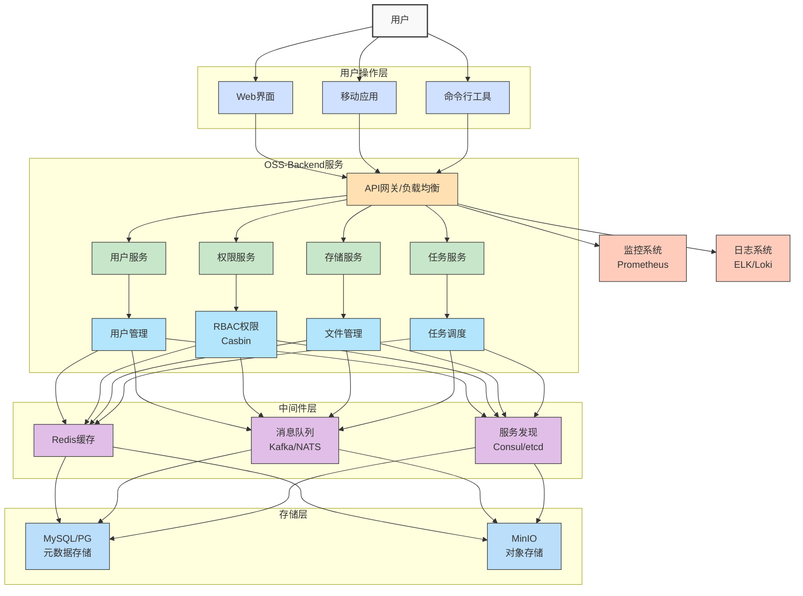
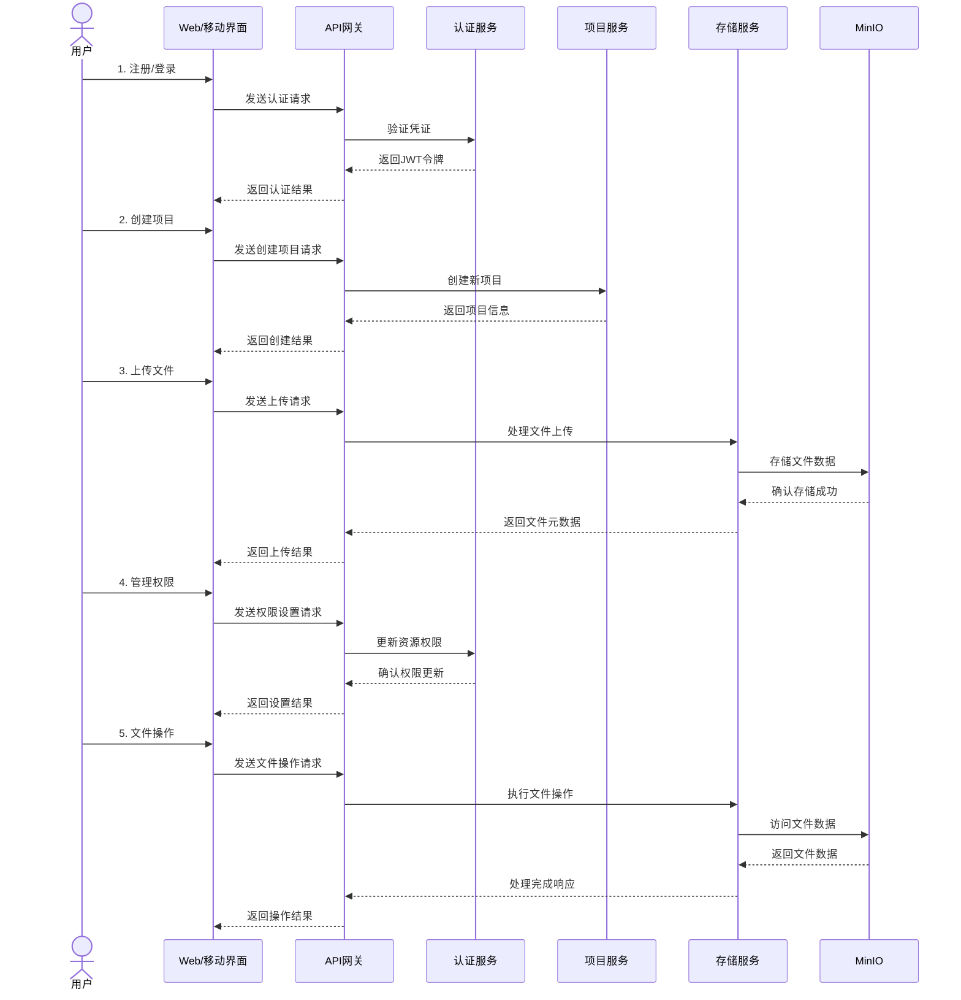
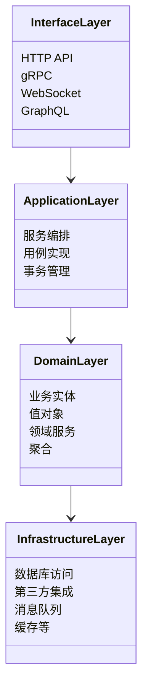
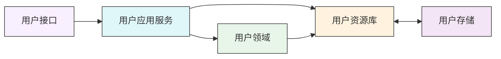
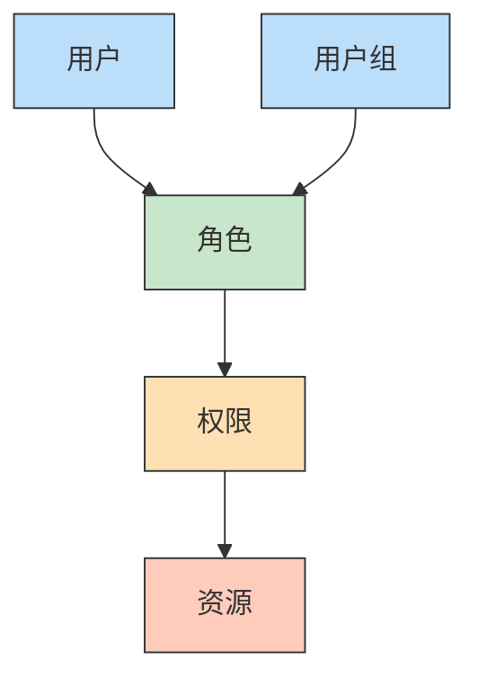
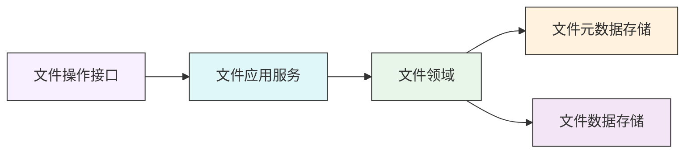
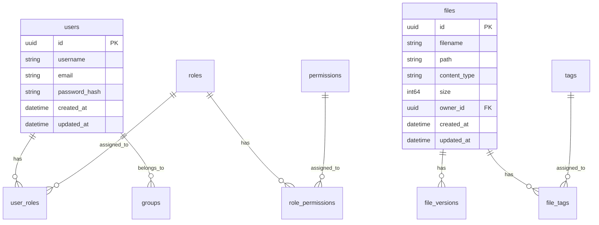
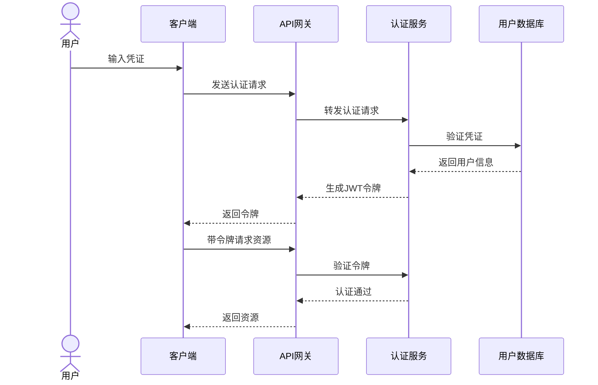
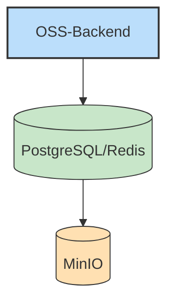
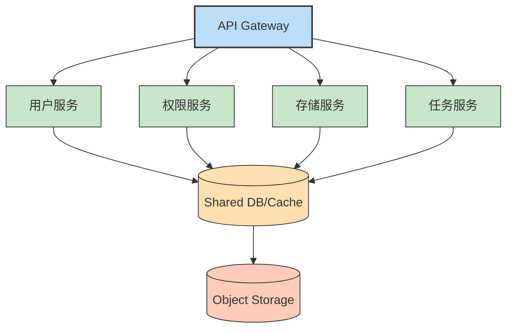

# OSS-Backend 系统架构设计

  
## 系统架构图

> **系统架构总览**: OSS-Backend是一个完整的对象存储服务，采用微服务架构，提供高性能、安全可靠的文件存储与管理功能

## 📋 目录

- [1. 系统概述](#1-系统概述)
- [2. 架构设计原则](#2-架构设计原则)
- [3. 整体架构](#3-整体架构)
- [4. 技术栈选型](#4-技术栈选型)
- [5. 核心模块设计](#5-核心模块设计)
- [6. 存储设计](#6-存储设计)
- [7. 认证与授权设计](#7-认证与授权设计)
- [8. 部署架构](#8-部署架构)
- [9. 性能与扩展性](#9-性能与扩展性)
- [10. 安全设计](#10-安全设计)

---

## 1. 系统概述

> OSS-Backend是一个基于Golang开发的对象存储服务后端系统，提供文件上传、下载、管理和访问控制等功能。系统设计采用微服务架构思想，将不同功能模块解耦，提高系统的可维护性和扩展性。

### 💠 核心层次结构

| 层级 | 说明 | 主要组件 |
|------|------|---------|
| **用户操作层** | 包括各种用户交互界面 | Web界面、移动应用、命令行工具 |
| **API网关层** | 统一入口，请求路由 | 负载均衡、认证鉴权组件 |
| **服务层** | 核心业务逻辑实现 | 用户服务、权限服务、存储服务、任务服务 |
| **中间件层** | 提供基础设施支持 | Redis缓存、消息队列、服务发现 |
| **存储层** | 负责数据持久化 | 元数据存储(MySQL/PG)、对象存储(MinIO) |

### 🔄 用户操作流程

1. **🔐 用户注册/登录**: 用户通过Web界面或移动应用注册账号并登录系统
2. **📂 项目创建**: 用户创建项目作为文件组织的容器
3. **📤 文件上传**: 用户将文件上传到指定项目，系统处理文件并存储
4. **🔒 权限设置**: 用户可设置文件/项目的访问权限，如私有、共享或公开
5. **🔧 文件管理**: 用户可进行文件查看、下载、删除、重命名等操作
6. **🔄 版本控制**: 系统支持文件版本控制，可查看和恢复历史版本

---

## 2. 架构设计原则

<table>
  <tr>
    <td align="center"><h3>📐</h3><strong>领域驱动设计</strong> <small>基于业务领域构建系统架构</small></td>
    <td align="center"><h3>🧩</h3><strong>整洁架构</strong> <small>关注点分离，依赖由外向内</small></td>
    <td align="center"><h3>🔌</h3><strong>微服务架构</strong> <small>服务解耦，独立部署和扩展</small></td>
  </tr>
  <tr>
    <td align="center"><h3>🔒</h3><strong>安全第一</strong> <small>数据安全和访问控制贯穿设计始终</small></td>
    <td align="center"><h3>⚖️</h3><strong>可扩展性</strong> <small>支持水平扩展以应对业务增长</small></td>
    <td align="center"><h3>📊</h3><strong>可观测性</strong> <small>内置监控、日志和追踪能力</small></td>
  </tr>
</table>

---

## 3. 整体架构

> 系统采用分层架构设计，实现了关注点分离和责任清晰化

### 🏢 核心服务组件

- **🌐 API网关**: 统一入口，请求路由，认证鉴权
- **👤 用户服务**: 用户管理，身份认证
- **🔑 权限服务**: 基于RBAC+Casbin的权限控制
- **💾 存储服务**: 文件存储管理，包含元数据和数据存储
- **⏱️ 任务调度服务**: 异步任务处理
- **📢 通知服务**: 系统通知和消息推送
- **📊 监控服务**: 系统监控和日志收集

---

## 4. 技术栈选型

### 🚀 编程语言与框架

<table>
  <tr>
    <th>类别</th>
    <th>技术选择</th>
    <th>说明</th>
  </tr>
  <tr>
    <td>主语言</td>
    <td><strong>Go 1.21+</strong></td>
    <td>高性能、低资源占用、并发友好</td>
  </tr>
  <tr>
    <td>Web框架</td>
    <td><strong>Gin</strong></td>
    <td>轻量、高性能的HTTP Web框架</td>
  </tr>
  <tr>
    <td>RPC框架</td>
    <td><strong>gRPC</strong></td>
    <td>高性能、跨语言的RPC框架</td>
  </tr>
  <tr>
    <td>API文档</td>
    <td><strong>Swagger/OpenAPI</strong></td>
    <td>RESTful API的设计和文档工具</td>
  </tr>
</table>

### 💾 存储层

- **关系型数据库**: PostgreSQL (元数据存储)
- **对象存储**: MinIO (文件数据存储)
- **缓存**: Redis
- **搜索引擎**: Elasticsearch (可选)

### 🔧 中间件与基础设施

- **消息队列**: Kafka/NATS
- **服务发现**: Consul/etcd
- **日志收集**: ELK/Loki
- **监控系统**: Prometheus + Grafana
- **链路追踪**: Jaeger/Zipkin

### 🚢 部署与运维

- **容器化**: Docker
- **编排系统**: Kubernetes
- **CI/CD**: GitHub Actions/Jenkins
- **配置管理**: Helm

---

## 5. 核心模块设计

### 👤 用户管理模块

提供用户注册、登录、个人信息管理、认证等功能，包括：

- 多种认证方式支持（账密、OAuth、LDAP等）
- 用户信息管理
- 安全设置与MFA
- 用户组管理

### 🔑 权限管理模块

基于RBAC模型和Casbin实现的动态权限系统，支持多维度的访问控制：

- 角色定义与管理
- 权限分配与继承
- 资源ACL控制
- API级别权限验证
- 数据行级权限控制

### 💾 文件存储模块

负责文件的上传、下载和管理：

- 大文件分片上传
- 断点续传
- 文件版本控制
- 元数据管理
- 文件加密存储
- 数据去重

### ⏱️ 任务调度模块

处理异步任务和长时间运行的作业：

- 文件处理（压缩、格式转换等）
- 批量操作
- 定时任务
- 重试机制
- 分布式作业调度

---

## 6. 存储设计

### 🗃️ 元数据存储

使用PostgreSQL存储系统元数据：

- 用户信息
- 权限配置
- 文件元数据
- 系统配置

### 📁 文件数据存储

使用MinIO作为对象存储后端：

- 按租户隔离存储桶
- 分层存储策略
- 内容寻址存储
- 加密存储支持

---

## 7. 认证与授权设计

### 🔐 认证流程

1. **多因素认证**: 支持密码、令牌、证书等多种认证方式
2. **JWT令牌**: 无状态会话管理
3. **OAuth集成**: 支持第三方登录
4. **会话管理**: 登录状态控制与安全退出

### 🔒 授权模型

<pre>
[request_definition]
r = sub, obj, act

[policy_definition]
p = sub, obj, act

[role_definition]
g = _, _

[policy_effect]
e = some(where (p.eft == allow))

[matchers]
m = g(r.sub, p.sub) && r.obj == p.obj && r.act == p.act
</pre>

---

## 8. 部署架构

### 🖥️ 单体部署

### 🌐 微服务部署

---

## 9. 性能与扩展性

### ⚡ 性能优化策略

<table>
  <tr>
    <td align="center"><h3>📊</h3><strong>连接池管理</strong> <small>优化数据库连接</small></td>
    <td align="center"><h3>⚡</h3><strong>缓存策略</strong> <small>多级缓存减少I/O</small></td>
    <td align="center"><h3>🔄</h3><strong>异步处理</strong> <small>非关键流程异步化</small></td>
  </tr>
  <tr>
    <td align="center"><h3>🚦</h3><strong>限流与降级</strong> <small>保护系统稳定性</small></td>
    <td align="center"><h3>🔥</h3><strong>预热与预取</strong> <small>减少冷启动开销</small></td>
    <td align="center"><h3>📈</h3><strong>监控与调优</strong> <small>持续性能优化</small></td>
  </tr>
</table>

### 📈 扩展性设计

- **水平扩展**: 无状态设计支持集群扩展
- **分片策略**: 按租户/时间分片数据
- **容量规划**: 弹性资源分配
- **热点识别**: 动态调整热点资源

---

## 10. 安全设计

### 🔒 数据安全

- **传输加密**: TLS/SSL通信加密
- **存储加密**: 文件加密存储
- **密钥管理**: KMS密钥统一管理
- **数据脱敏**: 敏感信息脱敏展示

### 🛡️ 应用安全

- **请求验证**: 输入数据验证
- **CSRF防护**: 跨站请求伪造防护
- **XSS防御**: 跨站脚本攻击防御
- **权限检查**: 多层次权限校验
- **日志审计**: 关键操作审计追踪

---

<strong>该文档将随系统发展持续更新，所有重大架构变更需经过架构评审并更新本文档。</strong>

 