# OSS-Backend 系统架构设计

<div align="center">
  
## 系统架构图

```mermaid
flowchart TD
    %% 定义主要层级
    subgraph 用户操作层
        direction LR
        WebUI[Web界面]
        MobileApp[移动应用]
        CLI[命令行工具]
    end
    
    subgraph 网关层
        direction LR
        Gateway["API网关\n(负载均衡)"]
        Monitor["监控系统\nPrometheus"]
        Logger["日志系统\nELK/Loki"]
    end
    
    subgraph OSS服务层["OSS-Backend 服务"]
        direction LR
        subgraph Services
            direction LR
            UserSrv[用户服务]
            AuthSrv[权限服务]
            StorageSrv[存储服务]
            TaskSrv[任务服务]
        end
        
        subgraph Modules
            direction LR
            UserMgt[用户管理]
            RBAC["RBAC权限\n(Casbin)"]
            FileMgt[文件管理]
            TaskScheduler[任务调度]
        end
    end
    
    subgraph 中间件层
        direction LR
        Redis[Redis缓存]
        MsgQueue["消息队列\nKafka/NATS"]
        Discovery["服务发现\nConsul/etcd"]
    end
    
    subgraph 存储层
        direction LR
        DB["MySQL\n元数据存储"]
        ObjectStore["MinIO\n对象存储"]
    end
    
    %% 连接各层组件
    用户操作层 --> Gateway
    
    Gateway --> Monitor
    Gateway --> Logger
    Gateway --> Services
    
    UserSrv --> UserMgt
    AuthSrv --> RBAC
    StorageSrv --> FileMgt
    TaskSrv --> TaskScheduler
    
    UserMgt & RBAC & FileMgt & TaskScheduler --> 中间件层
    
    中间件层 --> 存储层
    
    %% 样式设置 - 使用更明亮的配色
    classDef userLayer fill:#f0f8ff,stroke:#4682b4,stroke-width:2px,color:#333
    classDef gatewayLayer fill:#f0fff0,stroke:#3cb371,stroke-width:2px,color:#333
    classDef serviceLayer fill:#fff0f5,stroke:#db7093,stroke-width:2px,color:#333
    classDef middlewareLayer fill:#fff8dc,stroke:#daa520,stroke-width:2px,color:#333
    classDef storageLayer fill:#f5f5f5,stroke:#708090,stroke-width:2px,color:#333
    
    class WebUI,MobileApp,CLI userLayer
    class Gateway,Monitor,Logger gatewayLayer
    class UserSrv,AuthSrv,StorageSrv,TaskSrv,UserMgt,RBAC,FileMgt,TaskScheduler serviceLayer
    class Redis,MsgQueue,Discovery middlewareLayer
    class DB,ObjectStore storageLayer
    
    %% 设置子图样式 - 明亮背景
    style 用户操作层 fill:#f8f9fa,stroke:#4682b4,stroke-width:2px,color:#333
    style 网关层 fill:#f8f9fa,stroke:#3cb371,stroke-width:2px,color:#333
    style OSS服务层 fill:#f8f9fa,stroke:#db7093,stroke-width:2px,color:#333
    style 中间件层 fill:#f8f9fa,stroke:#daa520,stroke-width:2px,color:#333
    style 存储层 fill:#f8f9fa,stroke:#708090,stroke-width:2px,color:#333
    style Services fill:none,stroke:none
    style Modules fill:none,stroke:none
```

</div>

> **系统架构总览**: OSS-Backend是一个基于Go语言的对象存储服务，采用微服务架构，提供高性能、安全可靠的文件存储与管理功能

## 📋 目录

- [1. 系统概述](#1-系统概述)
- [2. 架构设计原则](#2-架构设计原则)
- [3. 整体架构](#3-整体架构)
- [4. 技术栈选型](#4-技术栈选型)
- [5. 核心模块设计](#5-核心模块设计)
- [6. 存储设计](#6-存储设计)
- [7. 认证与授权设计](#7-认证与授权设计)
- [8. 部署架构](#8-部署架构)
- [9. 性能与扩展性](#9-性能与扩展性)
- [10. 安全设计](#10-安全设计)

---

## 1. 系统概述

> OSS-Backend是一个基于Golang开发的对象存储服务后端系统，提供文件上传、下载、管理和访问控制等功能。系统设计采用微服务架构思想，将不同功能模块解耦，提高系统的可维护性和扩展性。

### 💠 核心层次结构

| 层级 | 说明 | 主要组件 |
|------|------|---------|
| **用户操作层** | 包括各种用户交互界面 | Web界面、移动应用、命令行工具 |
| **API网关层** | 统一入口，请求路由 | 负载均衡、认证鉴权组件 |
| **服务层** | 核心业务逻辑实现 | 用户服务、权限服务、存储服务、任务服务 |
| **中间件层** | 提供基础设施支持 | Redis缓存、消息队列、服务发现 |
| **存储层** | 负责数据持久化 | 元数据存储(MySQL)、对象存储(MinIO) |

### 🔄 用户操作流程

<div align="center">

```mermaid
sequenceDiagram
    actor User as 用户
    participant Web as Web/移动界面
    participant API as API网关
    participant Auth as 认证服务
    participant Project as 项目服务
    participant Storage as 存储服务
    participant Minio as MinIO
    
    User->>Web: 1. 注册/登录
    Web->>API: 发送认证请求
    API->>Auth: 验证凭证
    Auth-->>API: 返回JWT令牌
    API-->>Web: 返回认证结果
    
    User->>Web: 2. 创建项目
    Web->>API: 发送创建项目请求
    API->>Project: 创建新项目
    Project-->>API: 返回项目信息
    API-->>Web: 返回创建结果
    
    User->>Web: 3. 上传文件
    Web->>API: 发送上传请求
    API->>Storage: 处理文件上传
    Storage->>Minio: 存储文件数据
    Minio-->>Storage: 确认存储成功
    Storage-->>API: 返回文件元数据
    API-->>Web: 返回上传结果
    
    User->>Web: 4. 管理权限
    Web->>API: 发送权限设置请求
    API->>Auth: 更新资源权限
    Auth-->>API: 确认权限更新
    API-->>Web: 返回设置结果
    
    User->>Web: 5. 文件操作
    Web->>API: 发送文件操作请求
    API->>Storage: 执行文件操作
    Storage->>Minio: 访问文件数据
    Minio-->>Storage: 返回文件数据
    Storage-->>API: 处理完成响应
    API-->>Web: 返回操作结果
```

</div>

1. **🔐 用户注册/登录**: 用户通过Web界面或移动应用注册账号并登录系统
2. **📂 项目创建**: 用户创建项目作为文件组织的容器
3. **📤 文件上传**: 用户将文件上传到指定项目，系统处理文件并存储
4. **🔒 权限设置**: 用户可设置文件/项目的访问权限，如私有、共享或公开
5. **🔧 文件管理**: 用户可进行文件查看、下载、删除、重命名等操作
6. **🔄 版本控制**: 系统支持文件版本控制，可查看和恢复历史版本

---

## 2. 架构设计原则

<div align="center">
<table>
  <tr>
    <td align="center"><h3>📐</h3><strong>领域驱动设计</strong><br/><small>基于业务领域构建系统架构</small></td>
    <td align="center"><h3>🧩</h3><strong>整洁架构</strong><br/><small>关注点分离，依赖由外向内</small></td>
    <td align="center"><h3>🔌</h3><strong>微服务架构</strong><br/><small>服务解耦，独立部署和扩展</small></td>
  </tr>
  <tr>
    <td align="center"><h3>🔒</h3><strong>安全第一</strong><br/><small>数据安全和访问控制贯穿设计始终</small></td>
    <td align="center"><h3>⚖️</h3><strong>可扩展性</strong><br/><small>支持水平扩展以应对业务增长</small></td>
    <td align="center"><h3>📊</h3><strong>可观测性</strong><br/><small>内置监控、日志和追踪能力</small></td>
  </tr>
</table>
</div>

---

## 3. 整体架构

> 系统采用分层架构设计，实现了关注点分离和责任清晰化

<div align="center">

```mermaid
flowchart TD
    subgraph InterfaceLayer[接口层]
        direction LR
        HTTP[HTTP API]
        gRPC[gRPC]
        WS[WebSocket]
        GraphQL[GraphQL]
    end
    
    subgraph ApplicationLayer[应用层]
        direction LR
        ServiceComposition[服务编排]
        UseCases[用例实现]
        TransactionMgmt[事务管理]
    end
    
    subgraph DomainLayer[领域层]
        direction LR
        Entities[业务实体]
        ValueObjects[值对象]
        DomainServices[领域服务]
        Aggregates[聚合]
    end
    
    subgraph InfraLayer[基础设施层]
        direction LR
        DBAccess[数据库访问]
        ThirdPartyInteg[第三方集成]
        MsgQueues[消息队列]
        Cache[缓存]
    end
    
    InterfaceLayer --> ApplicationLayer
    ApplicationLayer --> DomainLayer
    DomainLayer --> InfraLayer
    
    %% 样式设置 - 明亮风格
    classDef interfaceStyle fill:#e3f2fd,stroke:#1976d2,stroke-width:2px,color:#333
    classDef appStyle fill:#e8f5e9,stroke:#43a047,stroke-width:2px,color:#333
    classDef domainStyle fill:#fff3e0,stroke:#ff9800,stroke-width:2px,color:#333
    classDef infraStyle fill:#fce4ec,stroke:#e91e63,stroke-width:2px,color:#333
    
    class HTTP,gRPC,WS,GraphQL interfaceStyle
    class ServiceComposition,UseCases,TransactionMgmt appStyle
    class Entities,ValueObjects,DomainServices,Aggregates domainStyle
    class DBAccess,ThirdPartyInteg,MsgQueues,Cache infraStyle
    
    %% 设置子图样式
    style InterfaceLayer fill:#f8f9fa,stroke:#1976d2,stroke-width:2px,color:#333
    style ApplicationLayer fill:#f8f9fa,stroke:#43a047,stroke-width:2px,color:#333
    style DomainLayer fill:#f8f9fa,stroke:#ff9800,stroke-width:2px,color:#333
    style InfraLayer fill:#f8f9fa,stroke:#e91e63,stroke-width:2px,color:#333
```

</div>

### 🏢 核心服务组件

<div align="center">

```mermaid
flowchart TD
    subgraph CoreComponents[核心服务组件]
        direction LR
        APIGateway[API网关]
        UserService[用户服务]
        AuthService[权限服务]
        StorageService[存储服务]
        TaskService[任务调度服务]
        NotificationService[通知服务]
        MonitoringService[监控服务]
    end
    
    %% 样式设置 - 明亮风格
    classDef componentStyle fill:#e1f5fe,stroke:#0288d1,stroke-width:2px,color:#333
    
    class APIGateway,UserService,AuthService,StorageService,TaskService,NotificationService,MonitoringService componentStyle
    
    %% 设置子图样式
    style CoreComponents fill:#f8f9fa,stroke:#0288d1,stroke-width:2px,color:#333
```

</div>

- **🌐 API网关**: 统一入口，请求路由，认证鉴权
- **👤 用户服务**: 用户管理，身份认证
- **🔑 权限服务**: 基于RBAC+Casbin的权限控制
- **💾 存储服务**: 文件存储管理，包含元数据和数据存储
- **⏱️ 任务调度服务**: 异步任务处理
- **📢 通知服务**: 系统通知和消息推送
- **📊 监控服务**: 系统监控和日志收集

---

## 4. 技术栈选型

### 🚀 编程语言与框架

<div align="center">
<table>
  <tr>
    <th>类别</th>
    <th>技术选择</th>
    <th>说明</th>
  </tr>
  <tr>
    <td>主语言</td>
    <td><strong>Go 1.21+</strong></td>
    <td>高性能、低资源占用、并发友好</td>
  </tr>
  <tr>
    <td>Web框架</td>
    <td><strong>Gin</strong></td>
    <td>轻量、高性能的HTTP Web框架</td>
  </tr>
  <tr>
    <td>ORM框架</td>
    <td><strong>GORM</strong></td>
    <td>功能丰富的Golang ORM库</td>
  </tr>
  <tr>
    <td>API文档</td>
    <td><strong>Swagger/OpenAPI</strong></td>
    <td>RESTful API的设计和文档工具</td>
  </tr>
</table>
</div>

### 💾 存储层

- **关系型数据库**: MySQL 8.0+ (元数据存储)
- **对象存储**: MinIO (文件数据存储)
- **缓存**: Redis
- **搜索引擎**: Elasticsearch (可选，待实现)

### 🔧 中间件与基础设施

- **消息队列**: Kafka/NATS (待实现)
- **服务发现**: Consul/etcd (待实现)
- **日志收集**: ELK/Loki (待实现)
- **监控系统**: Prometheus + Grafana (待实现)
- **链路追踪**: Jaeger/Zipkin (待实现)

### 🚢 部署与运维

- **容器化**: Docker
- **编排系统**: Docker Compose (Kubernetes待实现)
- **CI/CD**: GitHub Actions
- **配置管理**: 配置文件 + 环境变量

---

## 5. 核心模块设计

### 👤 用户管理模块

<div align="center">

```mermaid
flowchart LR
    subgraph UserModule[用户管理模块]
        direction LR
        UI[用户接口] --> AS[用户应用服务]
        AS --> DM[用户领域]
        AS --> UR[用户资源库]
        DM --> UR
        UR <--> US[用户存储]
    end
    
    %% 样式设置 - 明亮风格
    classDef userModuleStyle fill:#e3f2fd,stroke:#1976d2,stroke-width:2px,color:#333
    
    class UI,AS,DM,UR,US userModuleStyle
    
    %% 设置子图样式
    style UserModule fill:#f8f9fa,stroke:#1976d2,stroke-width:2px,color:#333
```

</div>

提供用户注册、登录、个人信息管理、认证等功能，包括：

- JWT令牌认证
- 用户信息管理
- 用户组管理
- 权限分配

### 🔑 权限管理模块

<div align="center">

```mermaid
flowchart TD
    subgraph PermissionModule[权限管理模块]
        direction LR
        User[用户] --> Role[角色]
        Group[用户组] --> Role
        Role --> Permission[权限]
        Permission --> Resource[资源]
    end
    
    %% 样式设置 - 明亮风格
    classDef permModuleStyle fill:#e8f5e9,stroke:#43a047,stroke-width:2px,color:#333
    
    class User,Group,Role,Permission,Resource permModuleStyle
    
    %% 设置子图样式
    style PermissionModule fill:#f8f9fa,stroke:#43a047,stroke-width:2px,color:#333
```

</div>

基于RBAC模型和Casbin实现的动态权限系统，支持多维度的访问控制：

- 角色定义与管理
- 权限分配与继承
- 资源ACL控制
- API级别权限验证

### 💾 文件存储模块

<div align="center">

```mermaid
flowchart LR
    subgraph StorageModule[文件存储模块]
        direction LR
        FI[文件操作接口] --> FS[文件应用服务]
        FS --> FD[文件领域]
        FD --> FM[文件元数据存储]
        FD --> FDS[文件数据存储]
    end
    
    %% 样式设置 - 明亮风格
    classDef storageModuleStyle fill:#fff3e0,stroke:#ff9800,stroke-width:2px,color:#333
    
    class FI,FS,FD,FM,FDS storageModuleStyle
    
    %% 设置子图样式
    style StorageModule fill:#f8f9fa,stroke:#ff9800,stroke-width:2px,color:#333
```

</div>

负责文件的上传、下载和管理：

- 文件上传与存储
- 文件版本控制
- 元数据管理
- 秒传功能

### ⏱️ 任务调度模块

处理异步任务和长时间运行的作业：

- 文件处理（压缩、格式转换等）
- 批量操作
- 定时任务

---

## 6. 存储设计

### 🗃️ 元数据存储

<div align="center">


</div>

使用MySQL存储系统元数据：

- 用户信息
- 权限配置
- 文件元数据
- 系统配置

### 📁 文件数据存储

<div align="center">

```mermaid
flowchart LR
    subgraph MinIOStorage[MinIO对象存储]
        direction LR
        Buckets[存储桶管理] --- Objects[对象管理]
        Objects --- Versions[版本控制]
        Versions --- Encryption[加密存储]
    end
    
    %% 样式设置 - 明亮风格
    classDef minioStyle fill:#e8eaf6,stroke:#3f51b5,stroke-width:2px,color:#333
    
    class Buckets,Objects,Versions,Encryption minioStyle
    
    %% 设置子图样式
    style MinIOStorage fill:#f8f9fa,stroke:#3f51b5,stroke-width:2px,color:#333
```

</div>

使用MinIO作为对象存储后端：

- 按项目划分存储桶
- 版本控制支持
- 文件内容去重

---

## 7. 认证与授权设计

### 🔐 认证流程

<div align="center">

```mermaid
sequenceDiagram
    actor User as 用户
    participant Client as 客户端
    participant API as API网关
    participant Auth as 认证服务
    participant DB as 用户数据库
    
    User->>Client: 输入凭证
    Client->>API: 发送认证请求
    API->>Auth: 转发认证请求
    Auth->>DB: 验证凭证
    DB-->>Auth: 返回用户信息
    Auth-->>API: 生成JWT令牌
    API-->>Client: 返回令牌
    Client->>API: 带令牌请求资源
    API->>Auth: 验证令牌
    Auth-->>API: 认证通过
    API-->>Client: 返回资源
```

</div>

1. **基于JWT的认证**: 使用JSON Web Token进行无状态身份验证
2. **令牌刷新**: 支持访问令牌和刷新令牌双令牌机制
3. **登录安全**: 密码哈希存储，防止暴力破解
4. **会话管理**: 登录状态控制与安全退出

### 🔒 授权模型

<div align="center">

```mermaid
flowchart LR
    subgraph CasbinModel[Casbin授权模型]
        Request[请求定义] --- Policy[策略定义]
        Policy --- Role[角色定义]
        Role --- Effect[策略效果]
        Effect --- Matcher[匹配器]
    end
    
    %% 样式设置 - 明亮风格
    classDef casbinStyle fill:#e0f7fa,stroke:#00acc1,stroke-width:2px,color:#333
    
    class Request,Policy,Role,Effect,Matcher casbinStyle
    
    %% 设置子图样式
    style CasbinModel fill:#f8f9fa,stroke:#00acc1,stroke-width:2px,color:#333
```

</div>

Casbin策略配置:

```
[request_definition]
r = sub, obj, act

[policy_definition]
p = sub, obj, act

[role_definition]
g = _, _

[policy_effect]
e = some(where (p.eft == allow))

[matchers]
m = g(r.sub, p.sub) && r.obj == p.obj && r.act == p.act
```

---

## 8. 部署架构

### 🖥️ 单体部署

<div align="center">

```mermaid
flowchart TD
    subgraph SingleDeployment[单体部署架构]
        direction LR
        OSS[OSS-Backend] --> DB[(MySQL/Redis)]
        DB --> MinIO[(MinIO)]
    end
    
    %% 样式设置 - 明亮风格
    classDef singleDepStyle fill:#f1f8e9,stroke:#7cb342,stroke-width:2px,color:#333
    
    class OSS,DB,MinIO singleDepStyle
    
    %% 设置子图样式
    style SingleDeployment fill:#f8f9fa,stroke:#7cb342,stroke-width:2px,color:#333
```

</div>

### 🌐 微服务部署 (未来规划)

<div align="center">

```mermaid
flowchart TD
    subgraph MicroserviceDeployment[微服务部署架构]
        direction LR
        API[API Gateway] --> US[用户服务]
        API --> AS[权限服务]
        API --> SS[存储服务]
        API --> TS[任务服务]
        
        US & AS & SS & TS --> DB[(Shared DB/Cache)]
        
        DB --> OS[(Object Storage)]
    end
    
    %% 样式设置 - 明亮风格
    classDef microDepStyle fill:#ffebee,stroke:#d32f2f,stroke-width:2px,color:#333
    
    class API,US,AS,SS,TS,DB,OS microDepStyle
    
    %% 设置子图样式
    style MicroserviceDeployment fill:#f8f9fa,stroke:#d32f2f,stroke-width:2px,color:#333
```

</div>

---

## 9. 性能与扩展性

### ⚡ 性能优化策略

<div align="center">
<table>
  <tr>
    <td align="center"><h3>📊</h3><strong>连接池管理</strong><br/><small>优化数据库连接</small></td>
    <td align="center"><h3>⚡</h3><strong>缓存策略</strong><br/><small>减少数据库查询</small></td>
    <td align="center"><h3>🔄</h3><strong>异步处理</strong><br/><small>非关键流程异步化</small></td>
  </tr>
  <tr>
    <td align="center"><h3>🚦</h3><strong>服务限流</strong><br/><small>防止资源耗尽</small></td>
    <td align="center"><h3>📦</h3><strong>文件秒传</strong><br/><small>避免重复上传</small></td>
    <td align="center"><h3>📈</h3><strong>性能监控</strong><br/><small>关键指标追踪</small></td>
  </tr>
</table>
</div>

### 📈 扩展性设计

<div align="center">

```mermaid
flowchart LR
    subgraph ScalabilityDesign[扩展性设计]
        direction LR
        HS[水平扩展] --- SS[按项目分片]
        SS --- CP[容量规划]
        CP --- HI[热点识别]
    end
    
    %% 样式设置 - 明亮风格
    classDef scalabilityStyle fill:#e8eaf6,stroke:#3f51b5,stroke-width:2px,color:#333
    
    class HS,SS,CP,HI scalabilityStyle
    
    %% 设置子图样式
    style ScalabilityDesign fill:#f8f9fa,stroke:#3f51b5,stroke-width:2px,color:#333
```

</div>

- **水平扩展**: 无状态设计支持集群扩展
- **分片策略**: 按项目/用户分片数据
- **容量规划**: 根据使用量调整资源

---

## 10. 安全设计

### 🔒 数据安全

<div align="center">

```mermaid
flowchart LR
    subgraph DataSecurity[数据安全]
        TE["传输加密\nHTTPS"] --- SE[密码哈希存储]
        SE --- KM[令牌安全管理]
        KM --- DM[敏感数据加密]
    end
    
    %% 样式设置 - 明亮风格
    classDef securityStyle fill:#fce4ec,stroke:#e91e63,stroke-width:2px,color:#333
    
    class TE,SE,KM,DM securityStyle
    
    %% 设置子图样式
    style DataSecurity fill:#f8f9fa,stroke:#e91e63,stroke-width:2px,color:#333
```

</div>

- **传输加密**: HTTPS通信加密
- **密码安全**: bcrypt哈希存储
- **令牌安全**: JWT签名验证
- **数据脱敏**: 敏感信息脱敏展示

### 🛡️ 应用安全

<div align="center">

```mermaid
flowchart LR
    subgraph AppSecurity[应用安全]
        direction LR
        RV[请求验证] --- CSRF[CSRF防护]
        CSRF --- XSS[XSS防御]
        XSS --- PC[权限检查]
        PC --- LA[操作审计]
    end
    
    %% 样式设置 - 明亮风格
    classDef appSecStyle fill:#f3e5f5,stroke:#9c27b0,stroke-width:2px,color:#333
    
    class RV,CSRF,XSS,PC,LA appSecStyle
    
    %% 设置子图样式
    style AppSecurity fill:#f8f9fa,stroke:#9c27b0,stroke-width:2px,color:#333
```

</div>

- **请求验证**: 输入数据验证
- **CSRF防护**: 跨站请求伪造防护 
- **XSS防御**: 跨站脚本攻击防御
- **权限检查**: 多层次权限校验
- **日志审计**: 关键操作审计追踪

---

<div align="center">
<strong>该文档将随系统发展持续更新，所有重大架构变更需经过架构评审并更新本文档。</strong>
</div> 